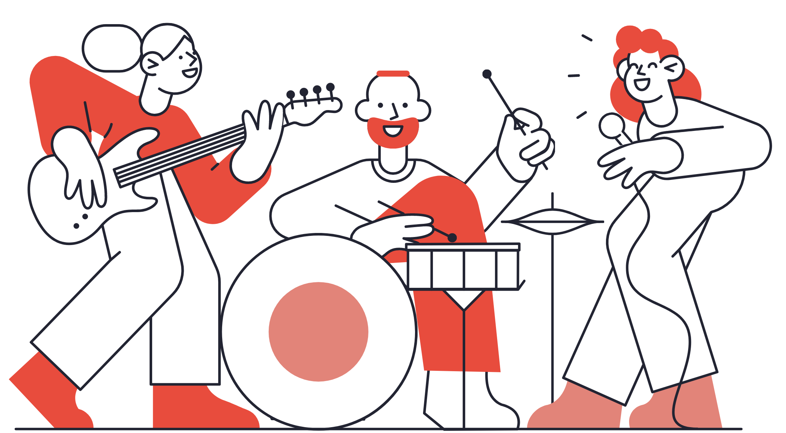

# Instajam


Instajam connects musicians to bands that are in need of their skills. After creating a profile as either a band or a musician,  users are then matched to the best potential bandmates based on the information they have provided. Users can then choose to receive the contact information of any match via text message.


# Technologies 
* Python3
* Flask
* PostgresSQL
* SQLAlchemy
* Jinja
* Bootstrap
* CSS
* JavaScript
* AJAX
* Twilio API


## Installation


Clone or fork this repo:
```bash
https://github.com/rachelmcginn/instajam
```
Create and activate a virtual environment inside your Instajam directory:
```bash
virtualenv env
source env/bin/activate
```
Install the dependencies:
```bash
pip install -r requirements.txt
```

Sign up to use the [Twilio API](https://www.twilio.com/try-twilio)

Save your API keys in a file called secrets.sh using this format:
```bash
export TWILIO_API_KEY="YOUR_KEY_HERE"
export TWILIO_AUTH_TOKEN="YOUR_TOKEN_HERE"
export TWILIO_PHONE="YOUR_TWILIO_PHONE_NUMBER"
```
Source your keys from your secrets.sh file into your virtual environment:
```bash
createdb instajam
python3 model.py
```
Run Instajam:
```bash
python3 server.py
```

Navigate to 'localhost:5000/' to access Instajam.


## License
MIT License

Copyright (c) 2021 Rachel McGinn

Permission is hereby granted, free of charge, to any person obtaining a copy
of this software and associated documentation files (the "Software"), to deal
in the Software without restriction, including without limitation the rights
to use, copy, modify, merge, publish, distribute, sublicense, and/or sell
copies of the Software, and to permit persons to whom the Software is
furnished to do so, subject to the following conditions:

The above copyright notice and this permission notice shall be included in all
copies or substantial portions of the Software.

THE SOFTWARE IS PROVIDED "AS IS", WITHOUT WARRANTY OF ANY KIND, EXPRESS OR
IMPLIED, INCLUDING BUT NOT LIMITED TO THE WARRANTIES OF MERCHANTABILITY,
FITNESS FOR A PARTICULAR PURPOSE AND NONINFRINGEMENT. IN NO EVENT SHALL THE
AUTHORS OR COPYRIGHT HOLDERS BE LIABLE FOR ANY CLAIM, DAMAGES OR OTHER
LIABILITY, WHETHER IN AN ACTION OF CONTRACT, TORT OR OTHERWISE, ARISING FROM,
OUT OF OR IN CONNECTION WITH THE SOFTWARE OR THE USE OR OTHER DEALINGS IN THE
SOFTWARE.